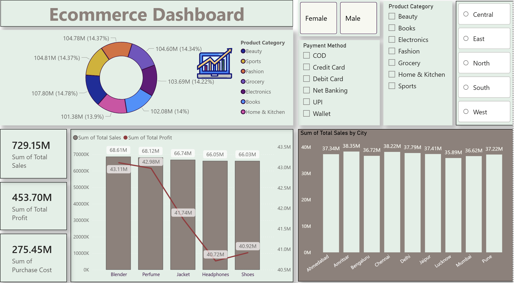
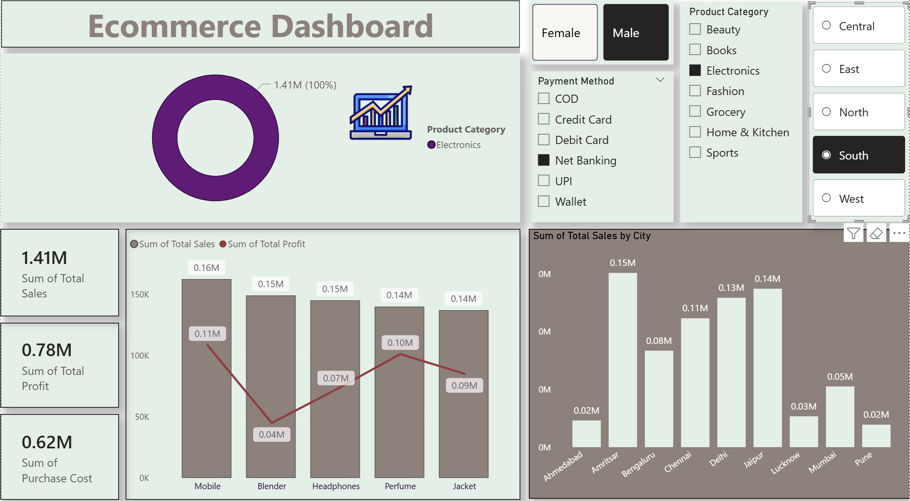

# ecommerce-sales-analysis
E‑commerce Sales Data Analysis using SQL, Python, and Power BI. Includes data cleaning, KPI tracking, trend analysis, and interactive dashboards to uncover insights on revenue, customer behavior, and product performance. Demonstrates end‑to‑end analytics skills.
## Dashboard Preview

